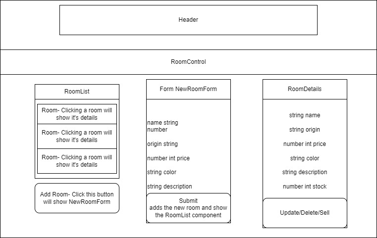

# Death Star Hotel

#### By Bodie Wood

## Technologies Used

* _JavaScript_
* _React_
* _HTML_
* _CSS_
* _Webpack_

## Description
_This website is for renting hotel rooms on the Death Star. Manager can Create, Read, Update and Delete rooms. The quantity of rooms can be updated as needed._



## Setup/Installation Requirements

* Clone repository to your desktop:
  1. GIT must be installed to clone repository. If GIT is needed, click here: [Install Git](https://docs.github.com/en/get-started/quickstart/set-up-git)
  2. Once GIT is installed, open your terminal and navigate to the desired landing folder
  3. In the terminal run:
    - ```git clone https://github.com/bodwood/death-star.git ```
    - ```cd death-star```
* Install Node.js. If Node.js is needed, click here: [Install Node.js](https://nodejs.org/en/)
  1. Once Node is installed, install dependencies by running the following:
    - ```npm install```
* Run application by typing the following in the terminal:
   - ```npm run start```
* Open [http://localhost:3000](http://localhost:3000) to view it in your browser

### Optional Scripts
* _Run ```npm test``` to launch the test runner in the interactive watch mode_
* _Run ```npm build``` to build the app for production to the `build` folder._
* _Run ```npm eject``` if you aren't satisfied with the build tool and configuration choices, you can `eject` at any time. This command will remove the single build dependency from your project._


## Known Bugs
* _N/A_

## License

**MIT License**

Copyright (c) 2023 Bodie Wood

Permission is hereby granted, free of charge, to any person obtaining a copy of this software and associated documentation files (the "Software"), to deal in the Software without restriction, including without limitation the rights to use, copy, modify, merge, publish, distribute, sublicense, and/or sell copies of the Software, and to permit persons to whom the Software is furnished to do so, subject to the following conditions:

The above copyright notice and this permission notice shall be included in all copies or substantial portions of the Software.

THE SOFTWARE IS PROVIDED "AS IS", WITHOUT WARRANTY OF ANY KIND, EXPRESS OR IMPLIED, INCLUDING BUT NOT LIMITED TO THE WARRANTIES OF MERCHANTABILITY, FITNESS FOR A PARTICULAR PURPOSE AND NONINFRINGEMENT. IN NO EVENT SHALL THE AUTHORS OR COPYRIGHT HOLDERS BE LIABLE FOR ANY CLAIM, DAMAGES OR OTHER LIABILITY, WHETHER IN AN ACTION OF CONTRACT, TORT OR OTHERWISE, ARISING FROM, OUT OF OR IN CONNECTION WITH THE SOFTWARE OR THE USE OR OTHER DEALINGS IN THE SOFTWARE.